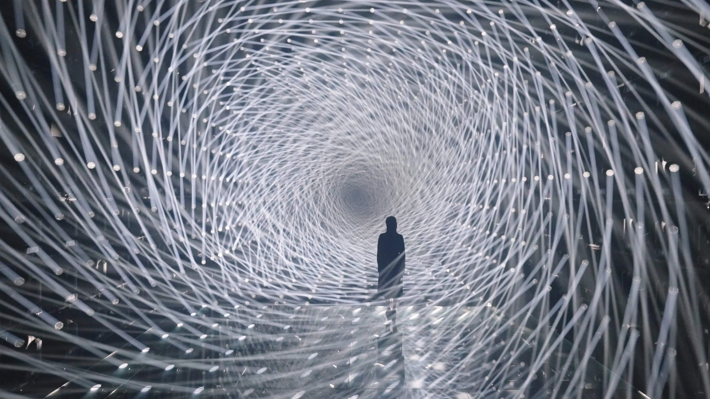

# Week 8 Quiz

## **Imaging Technique Inspiration**

### A source of inspiration for the group assignment is TeamLab’s artwork, which takes *lights* and *shapes* to create a dynamic and immersive artwork. The shapes they use are not always sophisticated or difficult to recreate but their use of vibrant colors and the way the simple shapes move around creates unique pieces. Drawing from their approach will help develop a dynamic and engaging artwork. The combination of colours, light and shadow adds depth, and the movement of shapes will help create immersive artwork. Adding user input animation will also make it an interactive and original artwork.

- Example 1 

- Example 2 

