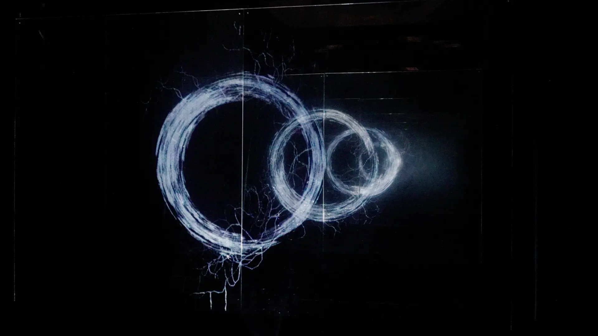
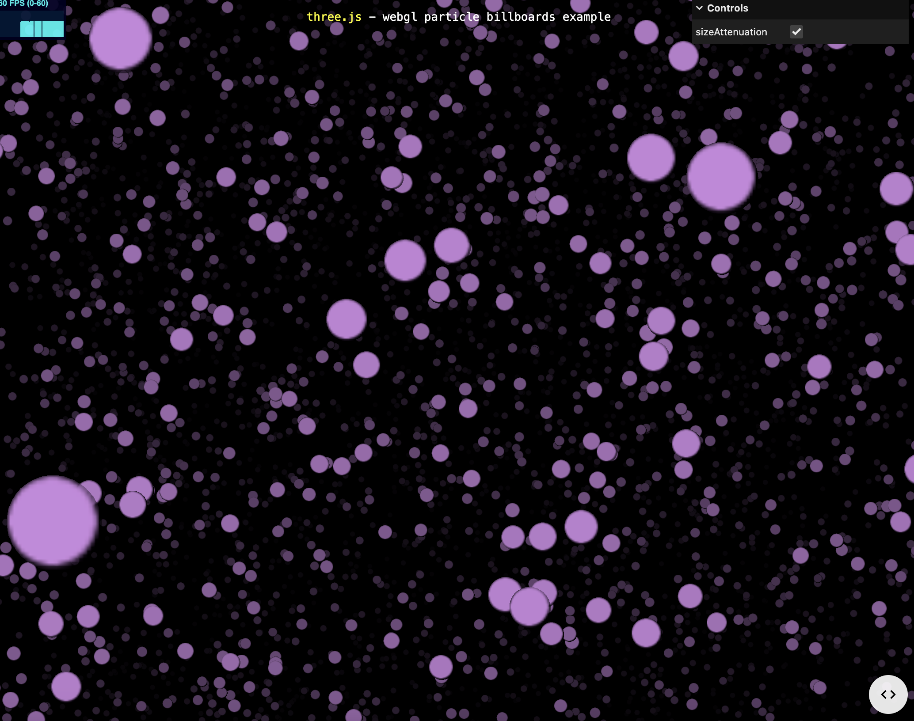
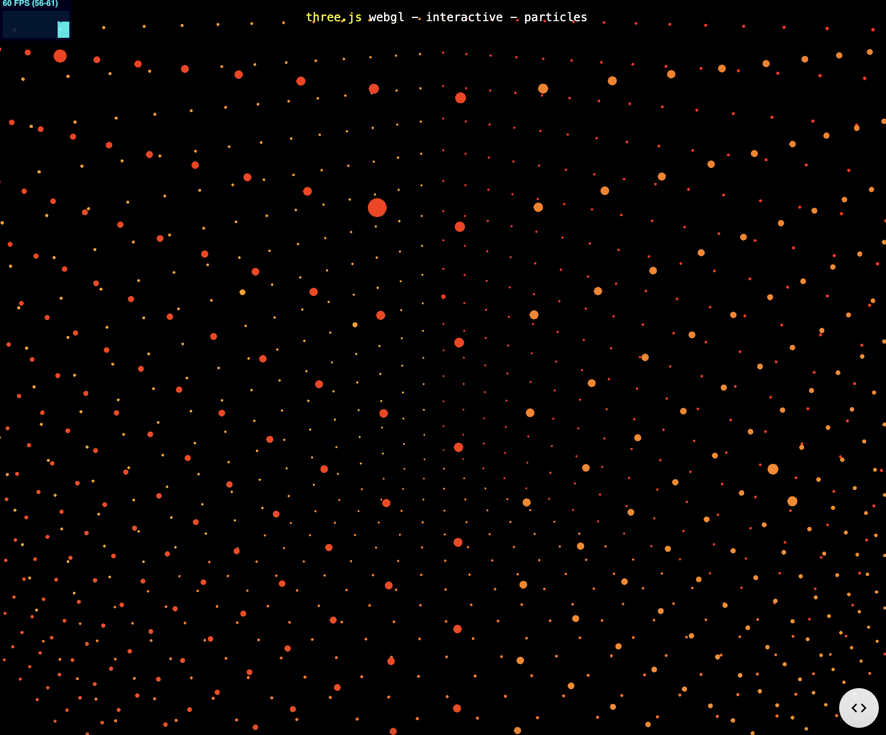
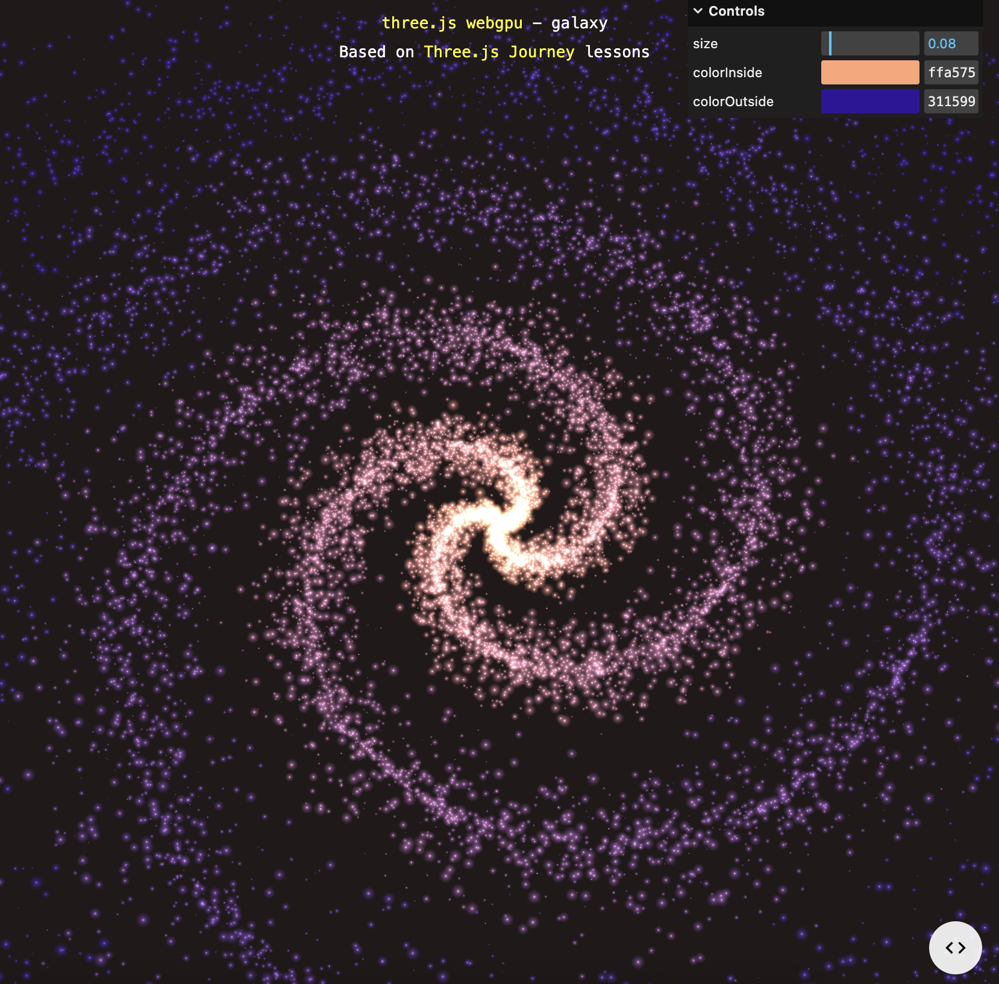

# Week 8 Quiz

## **Imaging Technique Inspiration**

#### An inspiration for the group assignment is TeamLab’s artwork, which takes *lights* and *shapes* to create a dynamic and immersive artwork. The shapes they use are not always sophisticated or difficult to recreate but their use of vibrant colors and the way the simple shapes move around creates unique pieces. Drawing from their approach will help develop a dynamic and engaging artwork. The combination of colours, light and shadow adds depth, and the movement of shapes will help create immersive artwork. Adding user input animation will also make it an interactive and original artwork.

- Example 1 - *The Rock where People Gather*

[Link to video](https://www.teamlab.art/w/iwa-waterparticles/)

- Example 2 - *Light Vortex*

[Link to video](https://www.teamlab.art/ew/lightvortex/)

- Example 3 - *Continuous Enso*

[Link to video](https://www.teamlab.art/ew/continuous_enso/)

## **Coding Technique**

#### Coding techniques that can be implemented to achieve such art are dynamic color changes, trigonomic functions and mouse interaction. Not only colors but adding hue, saturation and lightness will create dynamic and unique colors that will be eye-catching. Trigonomic functions such as sine and cosine will create smooth, cyclical patterns and movements that will help make the art more captivating. Adding mouse interaction will make the art more interactive and engaging for viewers.

- Example 1 

[Link](https://threejs.org/examples/#webgl_points_billboards)

- Example 2

[Link](https://threejs.org/examples/#webgl_interactive_points)

- Example 3

[Link](https://threejs.org/examples/?q=gala#webgpu_tsl_galaxy)
